# SQL Server 2017 Machine Learning Services による貸倒償却度合のWhat-If分析

## シナリオ

ローンデータをモデル化し、貸付金利を上昇させた場合の貸倒償却度合の変化についてWhat-If分析を行います。

## システムアーキテクチャ

1. ローンデータをDBにインポート
2. DBに取り込んだローンデータをメモリ最適化列ストア構造に変換する（機械学習による前処理の効率化）
3. Rにデータをロードしディシジョンフォレストによるモデルトレーニングを実行する
4. トレーニング済みモデルを利用しWhat-If分析を行い、結果をメモリ最適化行ストア構造に格納する（機械学習による後処理の効率化）
5. 分析結果をPower BIで可視化する

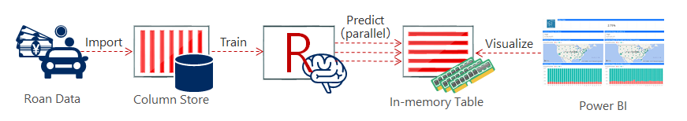

## はじめに

### ソフトウェア要件

* [SQL Server 2017](https://www.microsoft.com/en-us/sql-server/sql-server-2017)
* [SQL Server Management Studio](https://docs.microsoft.com/en-us/sql/ssms/download-sql-server-management-studio-ssms)
* [Power BI Desktop（英語版）](https://powerbi.microsoft.com/en-us/desktop/) 

(*) Power BI Desktop 英語版を用意してください（サンプルデータ内の位置データ（アメリカの州の略称データ）が日本語版のBingMap地図にマッピングができないため）。

### SQL Server の事前設定

- SQL Server 2017のDatabase Engine ServicesおよびMachine Learning Services（In-Database）のRをインストールしてください。

- SQL Server 2017 内でR実行するにはsp_configureでexternal scripts enabledの設定変更が必要です。またexternal scripts enabledパラメータは設定変更の反映にSQL Server 2017の再起動が必要です。

    - 1.外部スクリプト実行機能の有効化


        ```SQL:T-SQL
        EXEC sp_configure 'external scripts enabled', 1;
        ```

    - 2.SQL Server 2017の再起動

        ```cmd:cmd
        net stop "SQL Server Launchpad (MSSQLSERVER)"
        net stop "SQL Server (MSSQLSERVER)"
        net start "SQL Server (MSSQLSERVER)"
        net start "SQL Server Launchpad (MSSQLSERVER)"
        ```

        netコマンドに渡すインスタンス名は環境に応じて変更してください。またSQL Server AgentサービスなどSQL Serverサービスに依存するサービスがある場合には明示的に再開してください。

### サンプルデータ

LendingClub 社(貸付型クラウドファンディング事業者)が公開しているローンデータを利用します。

データダウンロードサイトへ行き、「DOWNLOAD LOAN DATA」から期間を選択してCSVファイルとしてダウンロードします。
より多くの期間を利用するのが望ましいです。この記事で紹介するデモは「2007-2011」～「2017 Q2」までのデータをダウンロードしています。

このCSVファイルには、現在のローンステータス（借入中、遅れ、完済など）や最新の支払い情報を含む、発行されたすべてのローンの完全なデータが含まれています。
### サンプルコード

* [Create Database.sql](Create Database.sql)
このチュートリアルに必要な各種データベースオブジェクトを作成します。

* [ImportCSVData.ps1](ImportCSVData.ps1)
ダウンロードしたサンプルデータをDBにインポートします。

* [Create Columnstore Index.sql](Create Columnstore Index.sql)
DBにインポートしたサンプルデータをメモリ最適化列ストア構造に変換します。

* [Create Model.sql](Create Model.sql)
Rにデータをロードしディシジョンフォレストによるモデルトレーニングを実行します。

* [ScoreLoans.ps1](ScoreLoans.ps1)
貸付金利を現状維持した場合の貸付評価のスコアリングを行います。

* [WhatIf.ps1](WhatIf.ps1)
貸付金利を変動した場合の貸付評価のスコアリングを行います。

* [Loan Status.pbix](Loan Status.pbix)
貸付金利を現状維持した場合と変動した場合それぞれの貸付評価をレポートし金利変動の影響を可視化します。

## チュートリアル

### STEP 1. データベースオブジェクトの作成

SSMSから[Create Database.sql](Create Database.sql)を実行し、データベースオブジェクトを作成します。

(*)データベースのデータファイルおよびトランザクションログは`C:\Tiger\DATA`に作成するよう記述されています。環境に応じて適宜変更してください。

```SQL:Create Database.sql（抜粋）
CREATE DATABASE [LendingClub]
 CONTAINMENT = NONE
 ON  PRIMARY 
( NAME = N'LendingClubData', FILENAME = N'C:\Tiger\DATA\LendingClub.mdf' , SIZE = 19210240KB , MAXSIZE = UNLIMITED, FILEGROWTH = 65536MB ), 
 FILEGROUP [InMemOLTP] CONTAINS MEMORY_OPTIMIZED_DATA  DEFAULT
( NAME = N'InMem', FILENAME = N'C:\Tiger\DATA\InMem' , MAXSIZE = UNLIMITED)
 LOG ON 
( NAME = N'LendingClubLog', FILENAME = N'C:\Tiger\DATA\LendingClub_log.ldf' , SIZE = 512MB , MAXSIZE = 2048GB , FILEGROWTH = 64MB )
GO
```

このSQL文が正常終了すると以下のオブジェクトが作成されます。

|オブジェクト種別|オブジェクト名|説明|
|:---|:---|:---|
|DATABASE|LendingClub|チュートリアルに使用するデータベース|
|TABLE|LoanStatsStaging|サンプルデータインポート用のステージングテーブル|
|TABLE|LoanStats|機械学習の対象となるローンデータ|
|TABLE|models|トレーニング済みモデルを格納するテーブル|
|TABLE|LoanStatsPredictions|貸付金利を現状維持した場合の貸付評価スコアを格納するテーブル|
|TABLE|LoanPredictionsWhatIf|貸付金利を変動した場合の貸付評価スコアを格納するテーブル|
|TABLE|WhatIf|What-If分析のために指定した貸付金利の引き上げ率を格納するテーブル|
|TABLE|RunTimeStats|実行時間を記録するためのテーブル|
|PROCEDURE|PerformETL|サンプルデータのETLを実行するプロシージャ|
|PROCEDURE|TrainLoansModel|ディシジョンフォレストによるモデルトレーニングを実行するプロシージャ|
|PROCEDURE|ScoreLoans|貸付金利を現状維持した場合の貸付評価のスコアリングを行うプロシージャ|
|PROCEDURE|ScoreLoansWhatIf|貸付金利を変動した場合の貸付評価のスコアリングを行うプロシージャ|

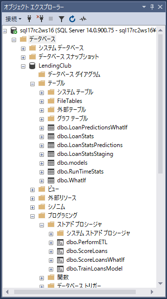

### STEP 2. サンプルデータのインポートとETL処理

PowerShellから[ImportCSVData.ps1](ImportCSVData.ps1)を実行し、サンプルデータをインポートします。

```PowerShell:ImportCSVData.ps1の処理の流れ
CSVファイルを格納したフォルダ配下のCSVファイルをForeachで取り出し {
    取り出したCSVファイル内の１レコードをForeachで取り出し {
        取り出した１レコードをLoanStatsStagingテーブルへINSERT
    }
    PerformETLプロシージャを呼び出し {
        LoanStatsStagingテーブルのデータを加工してLoanStatsテーブルに転送
        LoanStatsテーブルのデータに対して特徴抽出処理 {
            IF (loan_status列値が「Late (16-30 days)」「Late (31-120 days)」「Default」「Charged Off」)
                is_bad(貸付評価) = 1
            ELSE
                is_bad(貸付評価) = 0
        }
        LoanStatsStagingテーブルをDELETE
    }
}
```

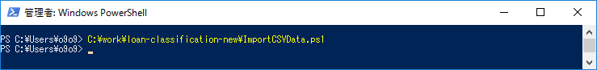

(*)DBへの接続情報、CSVファイルを格納したフォルダ`C:\Tiger\Extract\`、ログを出力するフォルダ'C:\Tiger\Logs\'は環境に応じて適宜変更してください。

```SQL:ImportCSVData.ps1（抜粋）
# Connection Info
$SqlServer = "." # TODO: Change the name of SQL Server instance name
$dbName = "LendingClub" # TODO: Change the name of the database

# Get a list of all the CSV files in the folder
$files = ls C:\Tiger\Extract\*.csv # TODO: Change the path to the appropriate location of the CSV files

# Log folder path
$LogPath = "C:\Tiger\Logs\" # TODO: Change the path of the log folder
```

(*)PowerShell内で実行しているInvoke-Sqlcmdの既定のタイムアウト値（30秒）が問題になる場合は適宜変更してください。

### STEP 3. インポートデータをメモリ最適化列ストア構造に変換

[Create Columnstore Index.sql](Create Columnstore Index.sql)を実行し、機械学習による前処理の効率化のためにインポートデータをメモリ最適化列ストア構造に変換します。

```SQL:Create Columnstore Index.sql
CREATE NONCLUSTERED COLUMNSTORE INDEX [ncci_LoanStats] ON [dbo].[LoanStats]
(
	[revol_util],
	[int_rate],
	[mths_since_last_record],
	[annual_inc_joint],
	[dti_joint],
	[total_rec_prncp],
	[all_util],
	[is_bad]
)WITH (COMPRESSION_DELAY = 0, MAXDOP = 1) ON [PRIMARY];
```

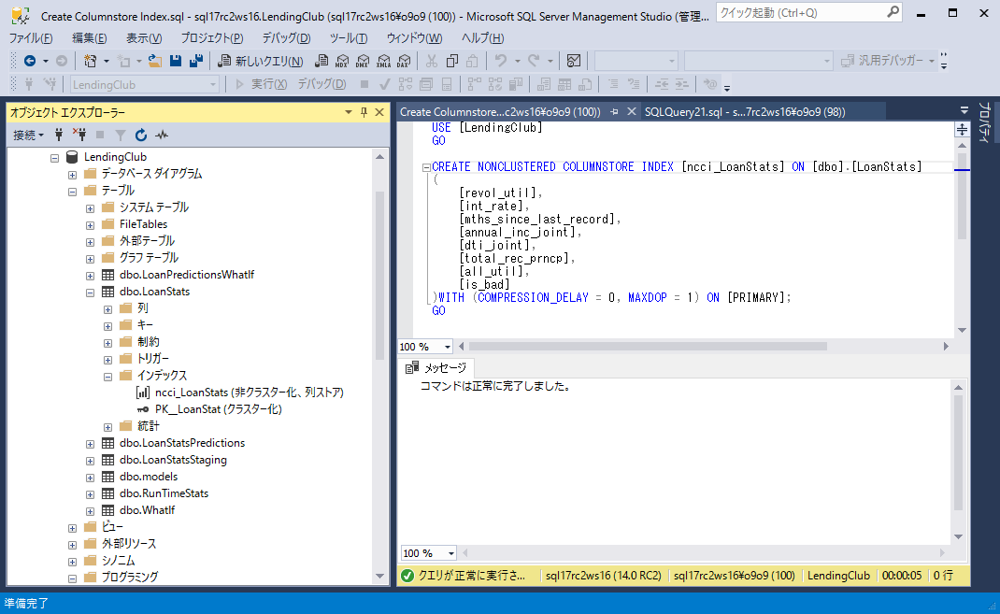

### STEP 4. ディシジョンフォレストによるモデルトレーニング

[Create Model.sql](Create Model.sql)を実行し、Rにデータをロードしディシジョンフォレストによるモデルトレーニングを実行し、トレーニング済みモデルをmodelテーブルに格納します。

Create Model.sql内で呼び出されているTrainLoansModelプロシージャが処理の実体です。トレーニングのためのデータセットはLoanStatsテーブルの75％サンプリングです。

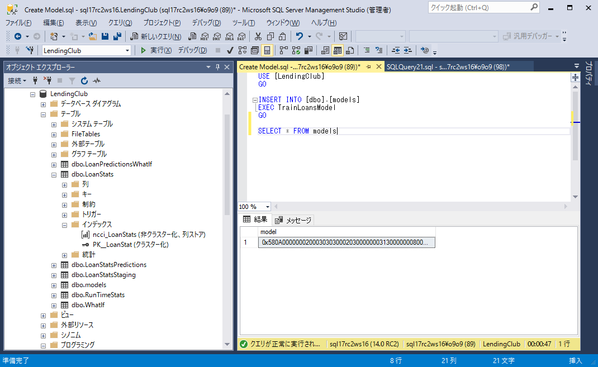

### STEP 5. 貸付金利を現状維持した場合の貸付評価のスコアリング

[ScoreLoans.ps1](ScoreLoans.ps1)を実行し、貸付金利を現状維持した場合の貸付評価のスコアリングを行います。

ScoreLoans.ps1内で呼び出されているScoreLoansプロシージャが処理の実体です。STEP 4で作成したモデルを利用し、LoanStatsテーブルのデータに対する貸付評価のスコアリングを行い、結果をLoanStatsPredictionsインメモリテーブルに格納します。

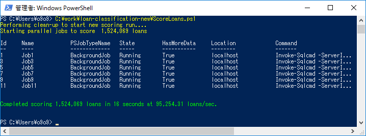

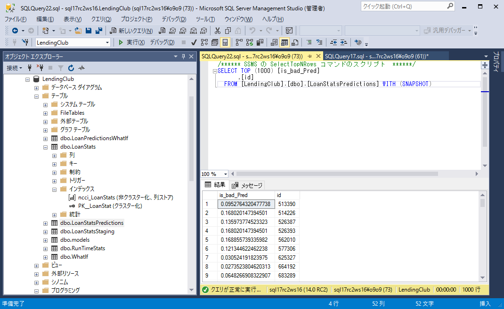

(*)DBへの接続情報は環境に応じて適宜変更してください。

```SQL:ScoreLoans.ps1（抜粋）
$SqlServer = "."  # TODO: Change the name of SQL Server instance name
$dbName = "LendingClub" # TODO: Change the name of the database
```

(*)スコアリングは並列実行（対象とするレコードの範囲ごとに分担処理）しています。高い多重度でWRITEを行うようなワークロードに対してインメモリテーブルの利用は適しています。さらにSETP 7.の可視化に伴うREADとの並列実行においても同様です。

### STEP 6. 貸付金利を変動した場合の貸付評価のスコアリング

[WhatIf.ps1](WhatIf.ps1)を実行し、貸付金利を現状維持した場合の貸付評価のスコアリングを行います。

WhatIf.ps1は変動させる貸付金利を対話型で受け取り（引き上げ率を％単位で指定してください）、処理の実体となるScoreLoansWhatIfプロシージャに渡します。
ScoreLoansWhatIfはSTEP 4で作成したモデルを利用し、貸付金利を変動させたLoanStatsテーブルのデータに対して貸付評価のスコアリングを行い、結果をLoanPredictionsWhatIfインメモリテーブルに格納します。

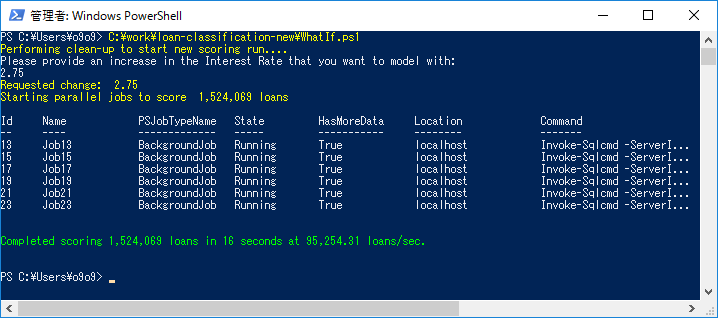

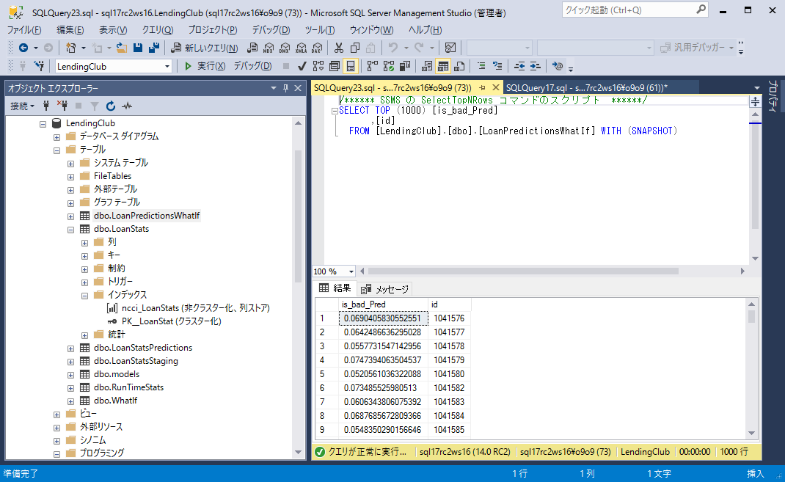

(*)DBへの接続情報は環境に応じて適宜変更してください。

```SQL:WhatIf.ps1（抜粋）
$SqlServer = "."  # TODO: Change the name of SQL Server instance name
$dbName = "LendingClub" # TODO: Change the name of the database
```

(*)スコアリングは並列実行（対象とするレコードの範囲ごとに分担処理）しています。高い多重度でWRITEを行うようなワークロードに対してインメモリテーブルの利用は適しています。さらにSETP 7.の可視化に伴うREADとの並列実行においても同様です。

### STEP 7. 金利変動による影響の可視化

以下の手順で貸付金利を現状維持した場合と変動した場合それぞれの貸付評価をレポートし金利変動の影響を可視化します。

1. [Loan Status.pbix](Loan Status.pbix)を開く
2. 接続情報を適宜変更する
    Menu -> Home -> Edit Queries -> Data Source Settings -> データベースのアイコンを選択 -> Change Source... でServerとDatabaseを適宜修正します。
    
    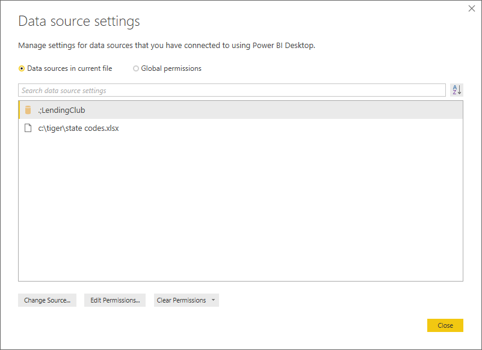
    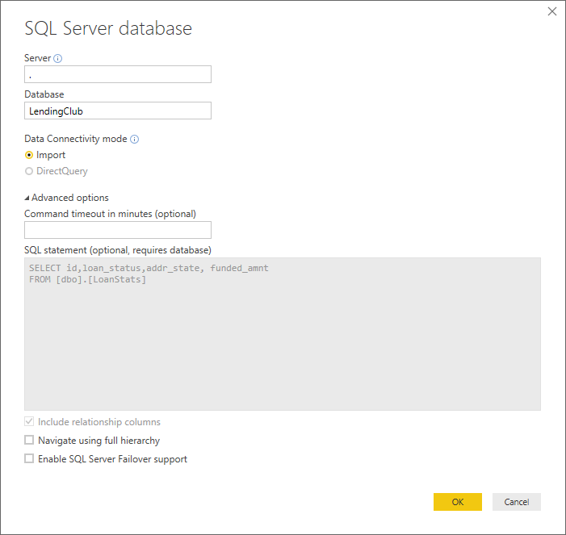

3. [State Codes.xlsx](State Codes.xlsx)（州名と略称のマッピング）のファイルパスを適宜変更する

    Menu -> Home -> Edit Queries -> Data Source Settings -> ファイルのアイコンを選択 -> Change Source... でFile pathを適宜修正します。

    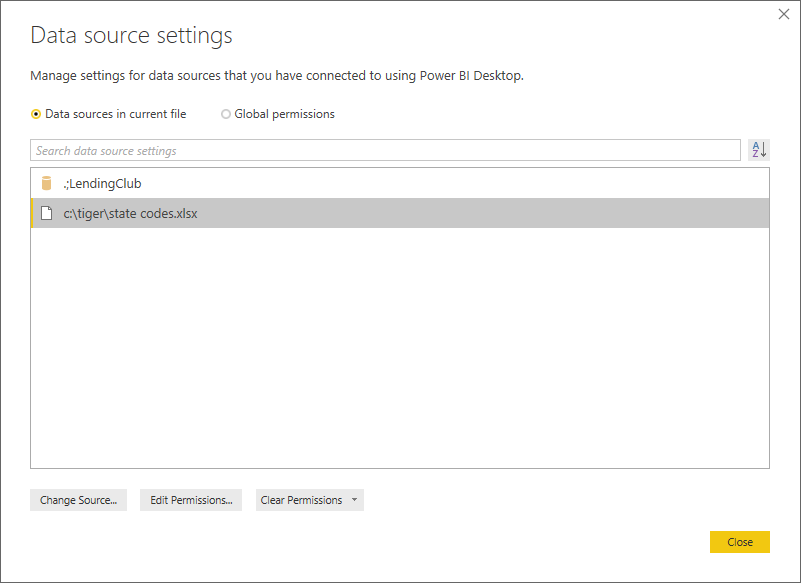

    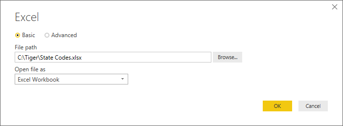

4. データをリフレッシュし最新のデータをインポートする

    以下のテーブルについては手動更新（Fields -> 対象のテーブルを右クリック -> Refresh data）を行います。

    * BasePrediction
    * Branch
    * States

    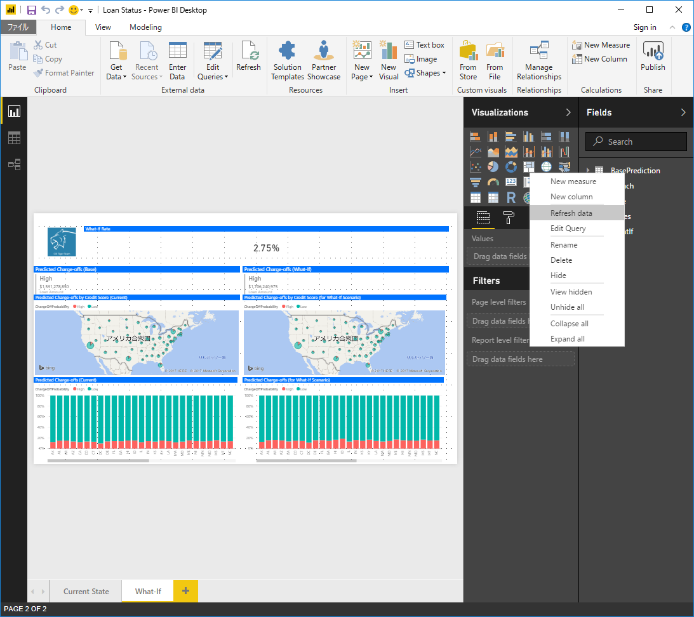

    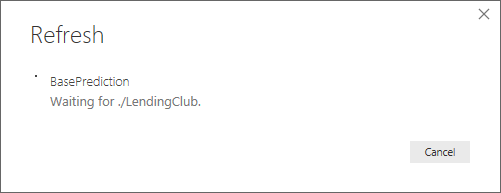

    (*) 上記はレポートのリフレッシュの対象外に設定しているために手動更新が必要です。

    以下についてはレポートのリフレッシュ（Menu -> Home -> Refresh）によって自動更新を行います。

    * Rate
    * WhatIf

    What-If分析のためにSTEP 6を実行する都度レポートのリフレッシュを行ってください。

    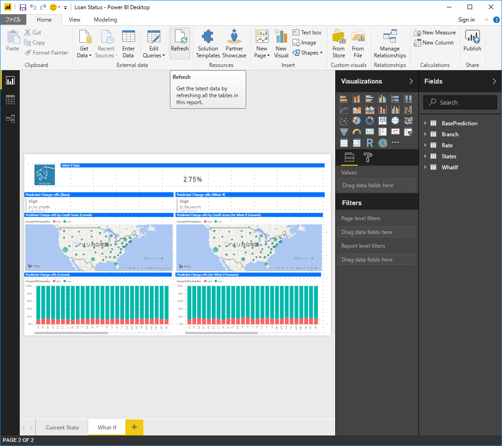

    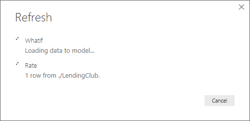

5. レポートを参照する

Loan Status Power BIレポートは以下の２つのレポートが用意されています。

* Current State：現在のローン情報

    * Distribution by Loan Status
    ローン状態ごとの貸付金額合計を示した積み上げ横棒グラフ

    * 上記の右にある表（Excelからの転記）
    州名を行、ローン状態を列で構成した表、数値は貸付金額合計

    * Distribution by Loan Status across States
    州ごとのローン状態の割合を貸付金額合計で示した100％積み上げ横棒グラフ

    * Loan Distribution Map
    ローン状態が"Current"になっている、州ごとの貸付金額合計を示した塗り分け地図

    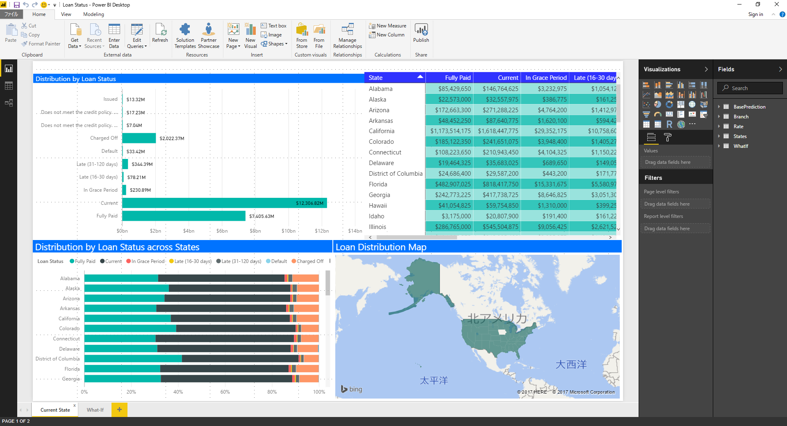

* What-If：予測値と金利をある数値で増加した時のWhat-If分析

    * ChargeOffProbability
    予測した貸倒償却度合を示す（High：リスク大、Low：リスク低）

    * What-If Rate
    What-If分析で指定した金利増加率を示したカード

    * Predicted Charge-offs (貸付金利を現状維持した場合と貸付金利を変動した場合それぞれ)
    ローン状態が"Current"の貸付金額合計を示したカード

    * Predicted Charge-offs by Credit Score (貸付金利を現状維持した場合と貸付金利を変動した場合それぞれ)
    州ごとの貸倒償却度合の高低の割合を示した地図

    * Predicted Charge-offs (貸付金利を現状維持した場合と貸付金利を変動した場合それぞれ)
    ローン状態が"Current"の、州ごとの貸付金額合計を貸倒償却度合の割合で示した100％積み上げ縦棒グラフ

    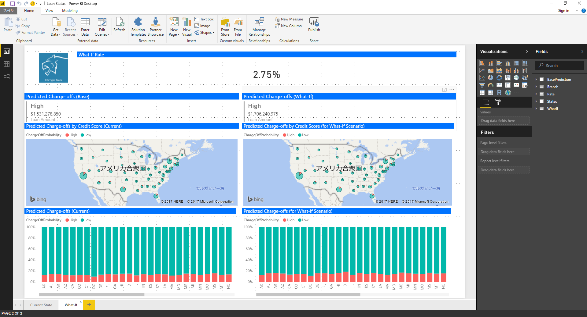

## 出典

[Loan Classification using SQL Server 2016 R Services](https://github.com/Microsoft/sql-server-samples/tree/master/samples/features/r-services/loan-classification)

## 関連

[A walkthrough of Loan Classification using SQL Server 2016 R Services](https://blogs.msdn.microsoft.com/sql_server_team/a-walkthrough-of-loan-classification-using-sql-server-2016-r-services/)

[Lending Club Statistics](https://www.lendingclub.com/info/download-data.action)

